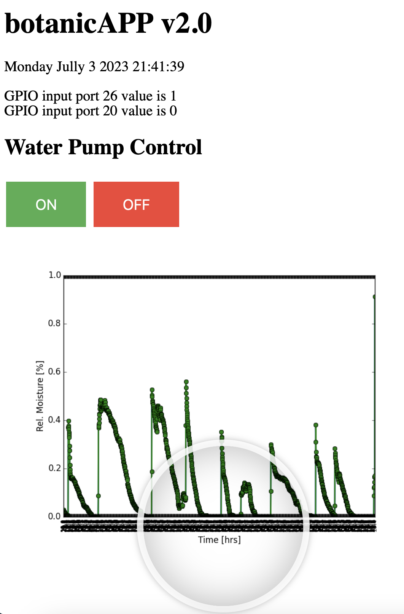

# `botanicAPP v2.0`

* Code repository for **Raspberry Pi** remote controlled water pump project
* Developer: BigDataFred

## Summary
REST-API that controls GPIO in and output pins of Raspberry Pi microcontroller.\
The Raspberry Pi device can be connected to a 12V DC water pump and operated through a dashboard.\
A  moisture sensor can also be connected to measure the soil humidity level.

## Installation
1. Clone the repository to your local machine
2. Install Python and NodeJS dependencies
3. Type the following command into your terminal to spin up the REST-API: \
`node ./webap/myapi.js`
4. In your webbrowser type `localhost:3000` to connect to the client and use the green and red buttons to activate the pump!
